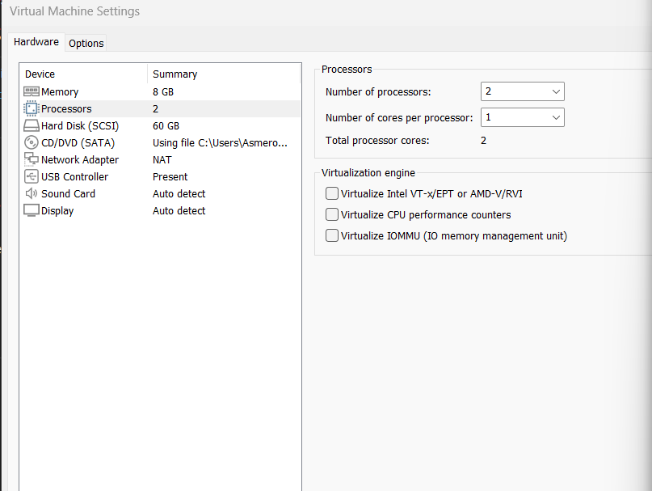
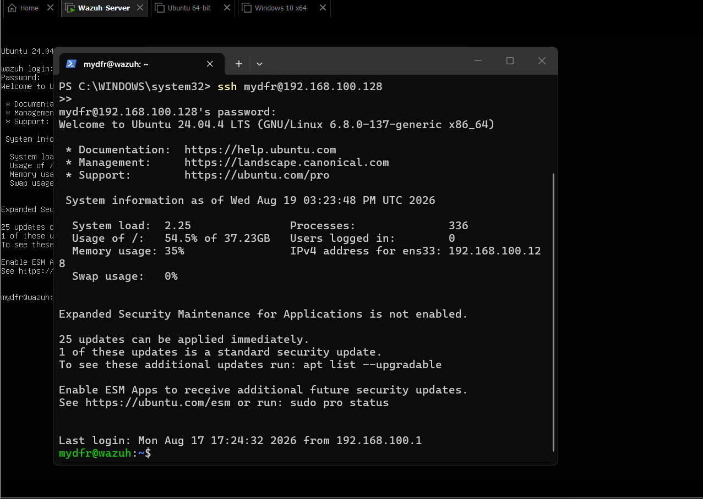
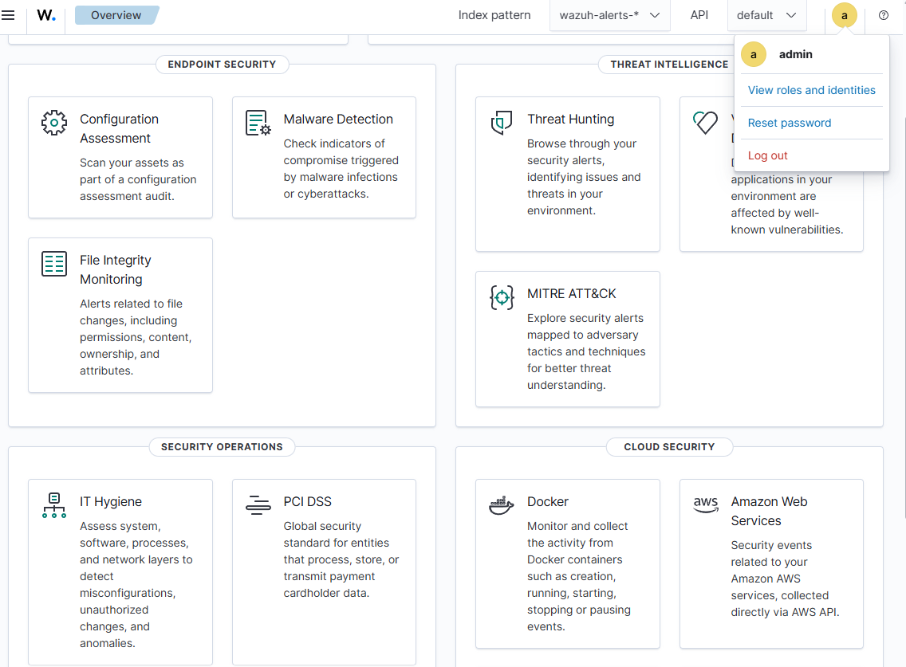
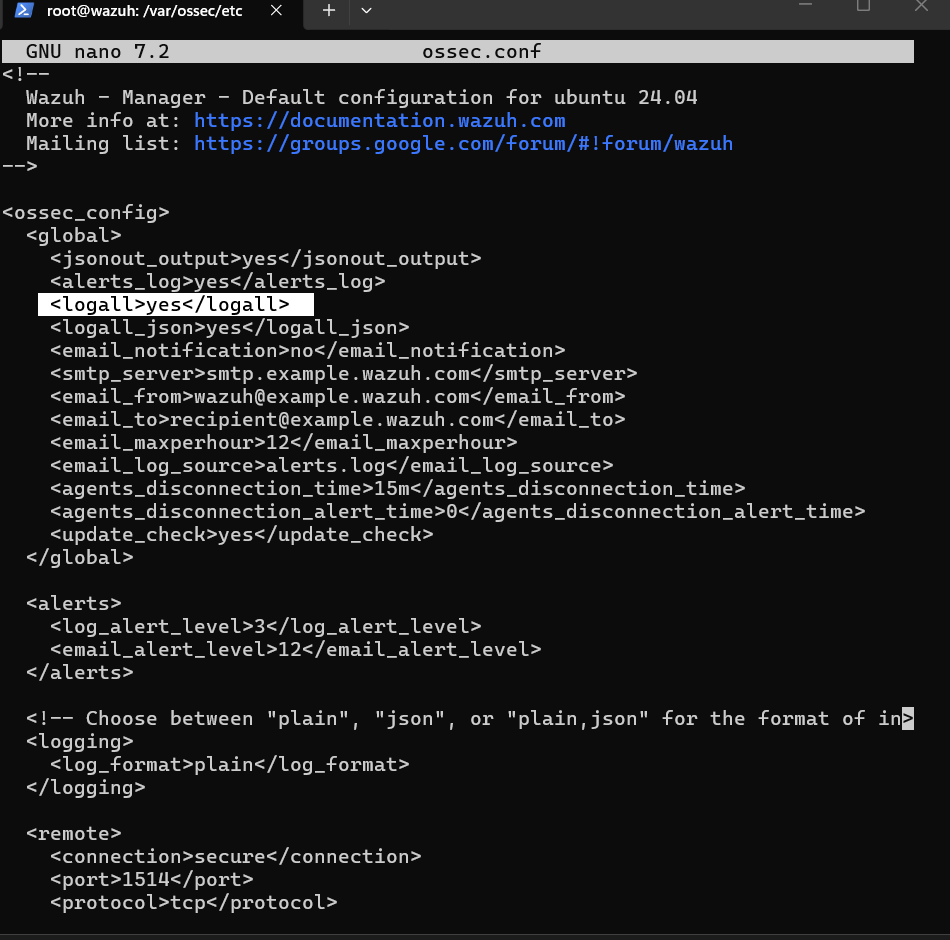
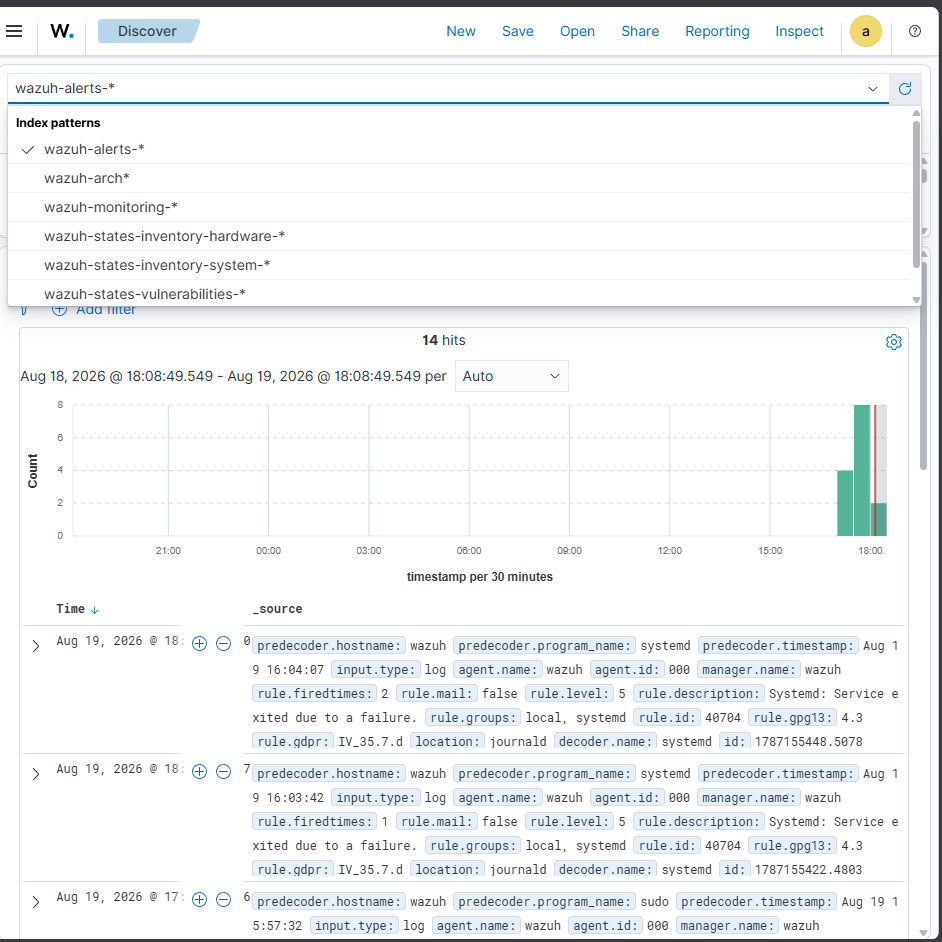
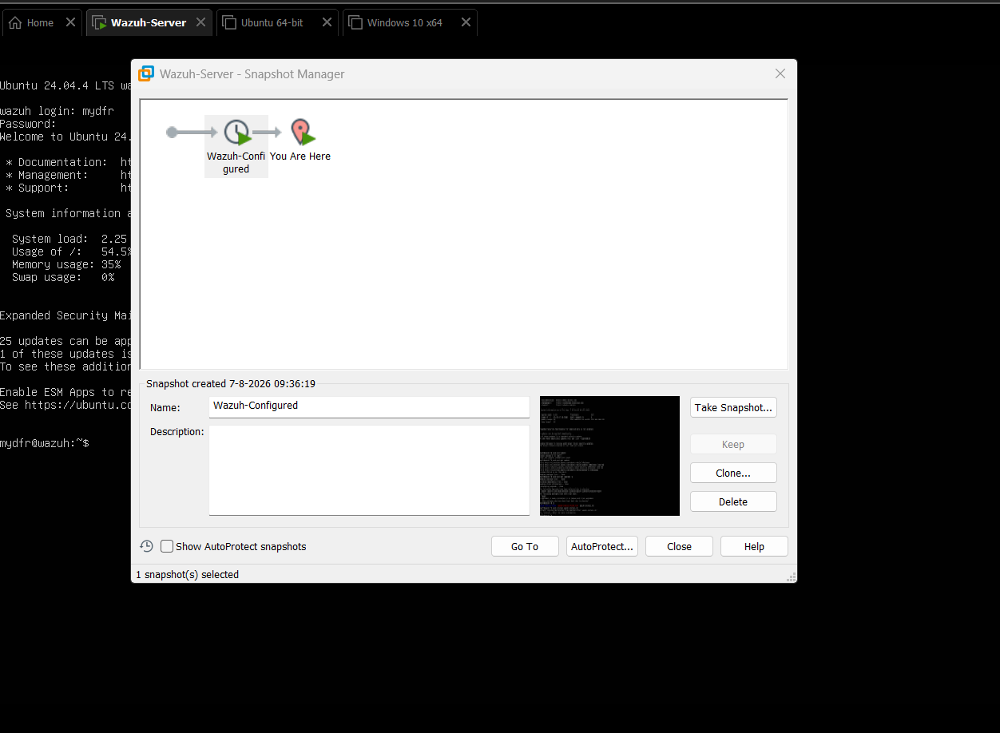

# Part 1: Wazuh-server opzetten

### 1. VMware Workstation Pro installeren

Ik heb een account aangemaakt op broadcom.com via de support portal (zonder VPN, want dat geeft vaak problemen bij registreren). Via **Software > VMware Cloud Foundation > My Downloads** heb ik de gratis versie van **VMware Workstation Pro** gevonden en gedownload voor Windows, na het accepteren van de licentievoorwaarden.

### 2. ISO's downloaden

Voor de Wazuh-server had ik Ubuntu Server nodig. Op ubuntu.com stond de nieuwste versie klaar (26.04), maar ik heb bewust gekozen voor **Ubuntu Server 24.04** via "Alternative downloads > Past releases", omdat een gloednieuwe versie mogelijk nog niet goed samenwerkt met Wazuh.

Voor de latere Windows-agent heb ik via microsoft.com de tool "Create Windows 10 installation media" gebruikt (voor Windows 10 is er, anders dan bij Windows 11, geen directe ISO-download) en gekozen voor de optie **ISO file**.

### 3. Wazuh-server VM aanmaken

In VMware Workstation Pro heb ik een nieuwe virtuele machine aangemaakt via **Create a new virtual machine > Custom**, met hardware compatibility **Workstation 25H2 of later** en de Ubuntu 24.04 ISO als installatiebestand. Ik heb de VM `Wazuh server` genoemd en de volgende specificaties gegeven:

| Onderdeel    | Waarde         |
| ------------ | -------------- |
| Processors   | 2              |
| Geheugen     | 8192 MB (8 GB) |
| Netwerk      | NAT            |
| Schijfruimte | 60 GB          |

Tijdens de Ubuntu-installatie heb ik als naam en gebruikersnaam `mydfir` ingevuld, de server `wazuh` genoemd, en **OpenSSH Server** aangevinkt — dat had ik nodig om straks via SSH te kunnen beheren. Na de herstart kreeg ik de melding "failed unmounting CD-ROM", die kun je gewoon wegklikken met Enter (of voorkomen door in de VM-instellingen de CD-ROM op "disconnect at power on" te zetten).

### 4. Verbinden via SSH

Na het inloggen heb ik het IPv4-adres genoteerd, zichtbaar rechtsboven in het inlogscherm (bijvoorbeeld `192.168.136.128`). Vanaf mijn hostmachine heb ik in PowerShell verbonden met:

```
ssh mydfir@<ip-adres>
```

De eerste keer moest ik `yes` typen om de fingerprint te accepteren, daarna mijn wachtwoord invoeren. Vanaf dit moment heb ik de server volledig via SSH beheerd, in plaats van via het VMware-scherm — dat werkt voor mij een stuk prettiger.

### 5. Wazuh installeren

Eerst heb ik het systeem bijgewerkt:

```
sudo apt-get update && sudo apt-get upgrade -y
```

Daarna ben ik naar wazuh.com gegaan, naar **Install Wazuh > Quick Start**, en heb ik het installatiecommando gekopieerd (versie 4.14 op het moment van installeren). Na het plakken en uitvoeren in mijn SSH-sessie toonde het scherm na een paar minuten het admin-account met wachtwoord. Ik heb het dashboard getest door in de browser naar `https://<ip-adres>` te gaan, de certificaatwaarschuwing weg te klikken (normaal bij een zelfondertekend certificaat) en in te loggen met de admin-gegevens.

### 6. Wachtwoord terugvinden

Als wachtwoord niet meteen bij de hand hebt, kan je het zo teruggevinden:

1. `ls` — toont het bestand `wazuh-install-files.tar`.
2. `tar -xf wazuh-install-files.tar` (bij "Permission denied": opnieuw met `sudo` ervoor).
3. `cd wazuh-install-files` (bij "Permission denied": eerst wisselen naar root).
4. `sudo su -` — wisselt naar de root-gebruiker, waarna ik terug kon navigeren naar de juiste map.
5. `ls` — toont het bestand `wazuh-passwords`.
6. `cat wazuh-passwords` — toont alle gegenereerde inloggegevens, waaronder het admin-account voor het dashboard ,het Wazuh API-account enzoor.
7. Wachtwoord genoteerd en getest door in te loggen.

_Let op: dit is voor een lab-omgeving. In een productieomgeving hoort een wachtwoord meteen gewijzigd en in een password manager bewaard te worden, niet in een los tekstbestand._

### 7. Archives inschakelen

Standaard bewaart Wazuh alleen events die een alert veroorzaken. Om ook gewone activiteit te bewaren, zoals geslaagde logins, heb ik het volgende gedaan:

1. `sudo su -` om als root te werken.
2. Ik ben genavigeerd naar `/var/ossec/etc/` en heb `nano ossec.conf` geopend.
3. Onder de `<global>`-sectie heb ik `logall` en `logall_json` van `no` naar `yes` gezet.
4. Ik heb opgeslagen met `Ctrl+X`, `Y`, `Enter`.
5. Ik heb de Wazuh manager herstart met `systemctl restart wazuh-manager` — dit is verplicht na elke wijziging in `ossec.conf`.
6. Ik heb `nano filebeat.yml` geopend en onder `archives` de waarde `enabled` van `false` naar `true` gezet, en opgeslagen.
7. Ik heb Filebeat herstart met `systemctl restart filebeat`.

### 8. Archive index pattern toevoegen

In het Wazuh Dashboard ben ik naar **Dashboard Management > Index Patterns** gegaan en heb ik een nieuw index pattern aangemaakt met de naam `wazuh-archives`, herkend als `wazuh-archives-4.x`. Als tijdveld heb ik `timestamp` gekozen. Via **Explore > Discover** kon ik daarna bevestigen dat de eerste archive-events zichtbaar waren.

### 9. Snapshot maken

In VMware Workstation heb ik met een rechtermuisklik op de Wazuh-server-VM een snapshot gemaakt via **Snapshot > Take Snapshot**, genoemd `Wazuh configured`. Zo kan ik altijd teruggaan naar deze werkende basisconfiguratie voordat ik verder ga met de agents.

## Screenshots







