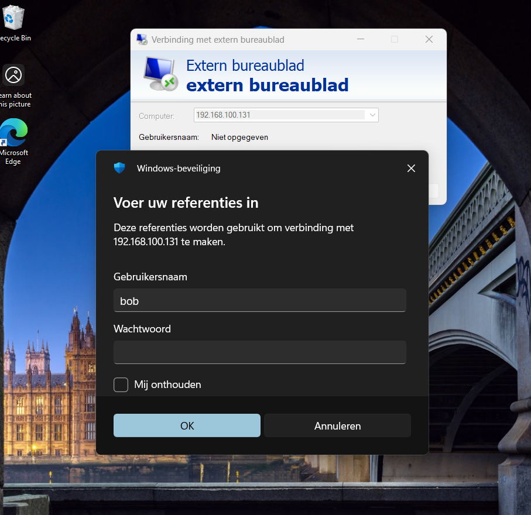
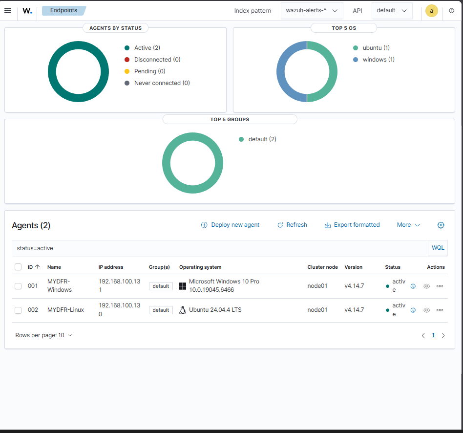
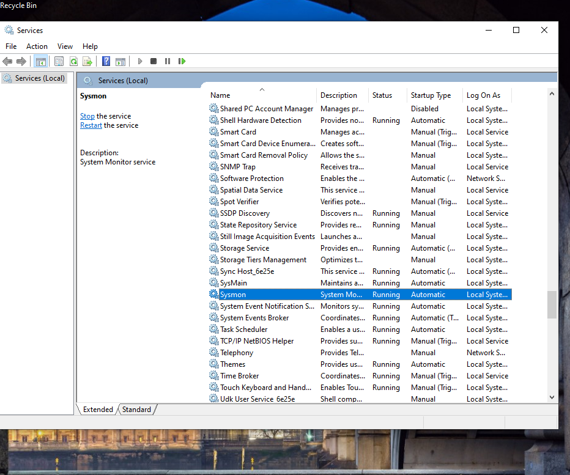
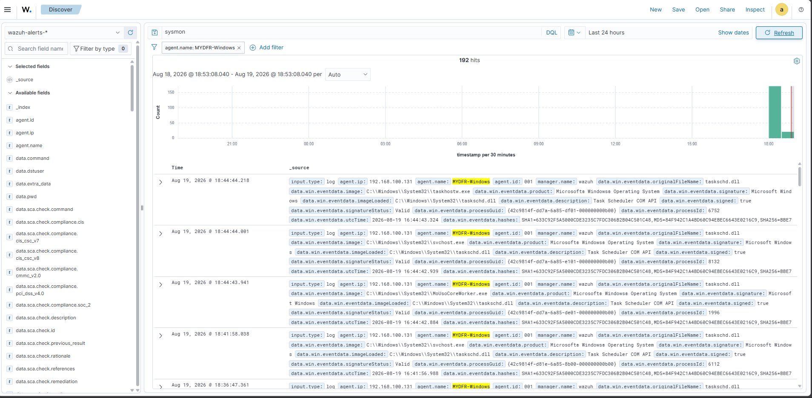
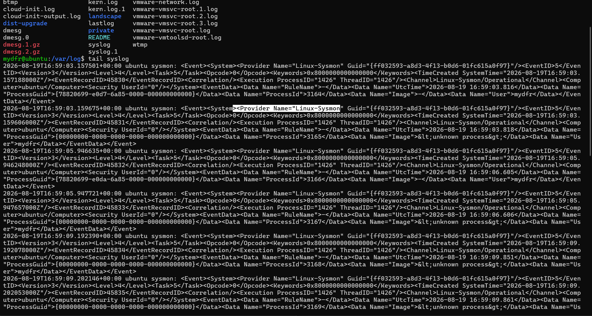

# Part 2: Agents koppelen

### 1. Windows- en tweede Ubuntu-VM aanmaken

Ik heb een tweede Ubuntu-VM aangemaakt met dezelfde ISO als de Wazuh-server: standaard processors, **4 GB** geheugen, netwerk **NAT** en **50 GB** schijfruimte. Tijdens de installatie heb ik weer `mydfir` als naam en gebruikersnaam gebruikt, hetzelfde wachtwoord ingesteld en **OpenSSH Server** aangevinkt.

Voor de Windows-VM heb ik dezelfde instellingen gebruikt, maar dan met de Windows 10 ISO, **4 GB** geheugen en **60 GB** schijfruimte. Bij de installatie heb ik gekozen voor **"I don't have a product key"**, editie **Windows 10 Pro** en installatietype **Custom**. Daarna via **"Set up for personal use" > Offline account > Limited experience** een gebruikersnaam `Bob` ingesteld, met wachtwoord en beveiligingsvragen.

### 2. Remote Desktop instellen

Op de Windows-VM heb ik via het Start-menu "remote" opgezocht, de Remote Desktop-instellingen geopend en Remote Desktop ingeschakeld. Via `cmd` en `ipconfig` heb ik het IP-adres van de Windows-VM genoteerd (bijvoorbeeld `192.168.136.130`). Vanaf mijn hostmachine heb ik daarna via **Remote Desktop Connection** verbinding gemaakt en ben ik ingelogd als `Bob`. Vanaf dit punt heb ik via RDP gewerkt in plaats van via de VMware-console — dat werkt een stuk fijner.

### 3. Windows-agent koppelen

In het Wazuh Dashboard heb ik **Deploy new agent** gekozen, pakkettype **Windows (MSI)**. Ik heb het serveradres van de Wazuh-server ingevuld (bijvoorbeeld `192.168.136.128`), de optie "remember server address" aangevinkt, en de agent de naam `mydfir-Windows` gegeven. Het gegenereerde installatiecommando heb ik gekopieerd en via mijn RDP-sessie in PowerShell uitgevoerd (**als Administrator**). Daarna heb ik ook het startcommando uitgevoerd — de melding "Wazuh service started successfully" bevestigde dat het gelukt was. Na ongeveer 30 tot 60 seconden en een refresh zag ik de Windows-agent als verbonden in het dashboard, met details zoals CPU, geheugen en hostname.

### 4. Linux-agent koppelen

Op dezelfde manier heb ik in het dashboard **Deploy new agent** gekozen, dit keer pakkettype **Linux (deb amd64)**, en de agent `mydfir-Linux` genoemd. Via SSH ben ik ingelogd op de tweede Ubuntu-VM en heb ik daar het installatie- en startcommando geplakt en uitgevoerd. Terug in het dashboard verscheen de Linux-agent als verbonden, herkend als Ubuntu 24.04.

### 5. Data checken in Discover

Via **Explore > Discover** heb ik de `wazuh-archives`-index geselecteerd en met het veld `agent.name` gefilterd op een specifieke agent. Ik heb ook gezocht op "Sysmon" om te controleren of er al iets binnenkwam — logisch genoeg nog niets, want Sysmon stond nog niet geïnstalleerd.

### 6. Sysmon op Windows installeren

Via de RDP-sessie heb ik Sysmon gedownload van de officiële Microsoft-pagina, en een configuratiebestand van **Olaf Hartong** (een bekend en veelgebruikt alternatief voor SwiftOnSecurity). Ik heb het Sysmon-zipbestand uitgepakt en het configuratiebestand ernaast gezet. Daarna heb ik Sysmon in PowerShell (**als Administrator**) geïnstalleerd met:

```
sysmon64.exe -i sysmonconfig.xml
```

Via **Services** heb ik gecontroleerd dat de Sysmon-service draaide.

### 7. Windows-agent configureren voor Sysmon-logs

Standaard stuurt de Wazuh-agent alleen Security-, System- en Application-logs door. Om ook Sysmon-events mee te sturen:

1. Ik heb Kladblok geopend **als Administrator** en `ossec.conf` geopend vanaf `C:\Program Files (x86)\ossec-agent\` (met de bestandsfilter op "Alle bestanden", anders is het bestand niet zichtbaar).
2. Ik heb het serveradres en de poort (**1514**) gecontroleerd — handig als er later geen events binnenkomen door een netwerkprobleem.
3. Ik heb een bestaande `<localfile>`-regel gekopieerd en aangepast om naar het Sysmon-logkanaal te verwijzen.
4. Ik heb de exacte kanaalnaam opgezocht via **Event Viewer > Applications and Services Logs > Microsoft > Windows > Sysmon > Operational**: `Microsoft-Windows-Sysmon/Operational`. Deze waarde heb ik in de nieuwe regel geplakt en opgeslagen.
5. Ik heb de Wazuh-agent service herstart via **Services** — nodig na elke wijziging in `ossec.conf`.
6. Terug in het dashboard waren Sysmon-events zichtbaar, bevestigd via het veld "system channel".

### 8. Sysmon for Linux installeren

Via SSH op de tweede Ubuntu-VM heb ik de officiële "Sysmon for Linux" GitHub-repository gevolgd: pakket geïnstalleerd, een "collect-all"-configuratiebestand gedownload met `wget`, en geïnstalleerd met:

```
sudo sysmon -i <configuratiebestand>
```

Sysmon-events op Linux worden weggeschreven naar `/var/log/syslog` — met `tail syslog` zag ik "Linux Sysmon"-events met Event ID 11. In het dashboard, met de filter op de Linux-agent, waren deze events ook zichtbaar. Als extra check heb ik `uname` uitgevoerd op de Ubuntu-VM en dit commando teruggevonden in Discover.

## Screenshots






