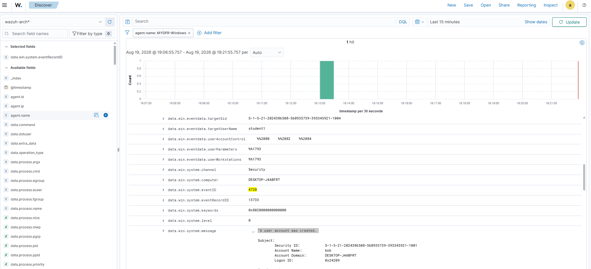
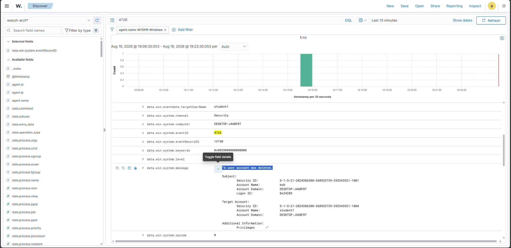
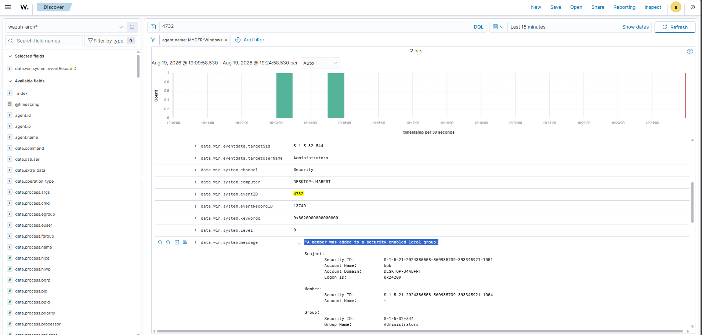
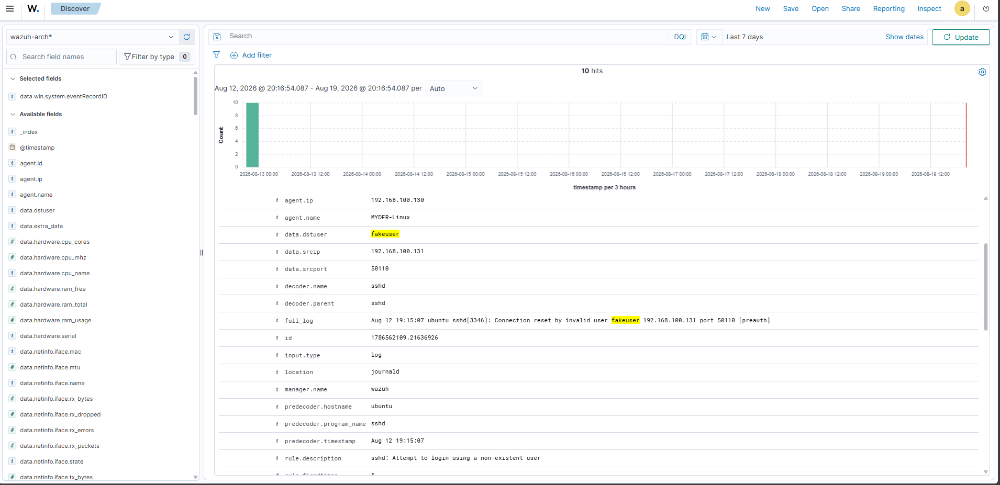
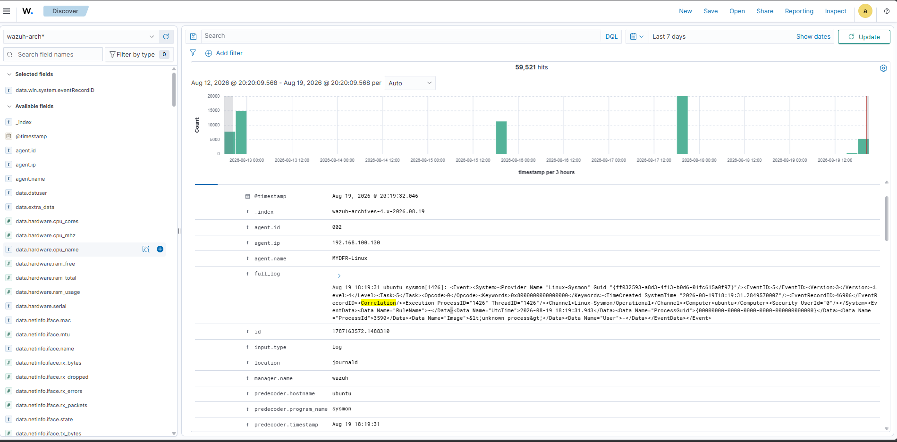

# Part 3: Telemetrie genereren en logs analyseren

### 1. Activiteit genereren op Windows

Via de RDP-sessie heb ik Command Prompt geopend **als Administrator** en de volgende commando's uitgevoerd:

1. `whoami` — toont hostnaam en huidige gebruiker (`Bob`).
2. `ipconfig /all` — toont netwerkinformatie.
3. `net user` — toont alle lokale gebruikersaccounts.
4. `net localgroup administrators` — toont wie in de Administrators-groep zit.
5. Ik heb via **Computer Management > Local Users and Groups > Users** gecontroleerd dat het Guest-account standaard **uitgeschakeld** is.
6. `net user guest /active:yes` — Guest-account geactiveerd.
7. `net user guest mydfirpass` — wachtwoord van het Guest-account gewijzigd.
8. `net user student1 <wachtwoord> /add` — nieuw account `student1` aangemaakt.
9. `net localgroup administrators student1 /add` — `student1` toegevoegd aan de Administrators-groep.
10. `net user student1 /delete` — account `student1` weer verwijderd.

### 2. Windows event ID's analyseren

Terug in het dashboard heb ik in **Discover** gefilterd op mijn Windows-agent, met de tijdspanne op de laatste 15 minuten.

**Event ID 4726 — Account was deleted**
Direct zichtbaar bovenaan, omdat `student1` als laatste actie verwijderd was. Onder `data.win.system.message` staat de leesbare beschrijving, met **Subject** (wie voerde de actie uit — Bob) en **Target** (wie werd geraakt — `student1`). Een Security ID (SID) volgt het formaat `S-R-X-Y...`: **S** = string is een SID, **R** = revisieniveau, **X** = identifier authority, **Y** = sub-authority waarden. De laatste cijfers noemen we de **RID** (Relative Identifier) — bijvoorbeeld RID 500 = Administrator, RID 501 = Guest, RID 502 = KRBTGT-account.

**Event ID 4720 — A user account was created**
Gevonden door te zoeken op `data.win.system.eventID:4720` (veldnamen zijn hoofdlettergevoelig). Attributen zoals **Primary Group ID** en de **UAC-waarde** zijn te herleiden via Microsoft Learn. Een UAC-waarde zoals `0x15` is een optelling van hex-codes — in dit geval de combinatie "Normal account" + "Password not required" + "Account disabled".

**Event ID 4624 — An account was successfully logged on**
Pas zichtbaar na een directe login via de VMware-console. Belangrijk veld: **Logon Type** — type 2 is interactief (console), type 3 is netwerk/SMB, type 10 is RDP. Ik heb steeds gezocht op de **wazuh-archives** index, niet alleen op alerts, omdat niet elke logon een alert genereert.

**Event ID 4732 — A member was added to a security-enabled local group**
Toont wie de actie uitvoerde (Subject) en welk account werd toegevoegd (Target). Soms staat er geen accountnaam bij het Target, alleen een SID — dan zoek je die SID apart op om de bijbehorende gebruikersnaam te vinden.

### 3. Activiteit genereren op Linux (SSH)

Vanaf de Windows-VM heb ik via PowerShell eerst een SSH-verbinding geprobeerd naar de Ubuntu-VM met een niet-bestaand account — na drie mislukte pogingen werd de verbinding geweigerd. Daarna ben ik succesvol ingelogd met het echte account (`mydfir`) en heb ik `ip a` uitgevoerd.

### 4. Linux/SSH-logs analyseren

Terug in Discover, met de wazuh-archives index:

- Zoeken op de naam van het niet-bestaande account toonde **"Connection reset by invalid user"** en **"Failed password for invalid user"**, met het bron-IP van de aanvaller.
- Zoeken op het echte account (`mydfir`) toonde **"Accepted password"** — dit betekent een geslaagde authenticatie.
- Elke succesvolle SSH-login krijgt een **sessie-ID** (bijvoorbeeld "New session 18 of user mydfir" bij het inloggen, later "Session 18 deactivated" bij het uitloggen). Door op dit sessie-ID te zoeken, kun je alle acties binnen die sessie samenvoegen tot één tijdlijn.
- Ook het **SSHD process ID** kan gebruikt worden om events aan elkaar te koppelen.
- Met **"View surrounding documents"** kun je events rond een specifiek tijdstip bekijken.
- Sysmon-events op Linux bevatten een veld **Terminal Session ID**, waarmee je uitgevoerde commando's kunt koppelen aan een specifieke SSH-sessie.

Ter afsluiting heb ik opnieuw ingelogd en `cat /etc/passwd > /tmp/loot.txt` uitgevoerd — een voorbeeld van hoe iemand systeeminformatie zou kunnen wegschrijven naar een bestand, en hoe je dat terugvindt in de logs.

## Screenshots

