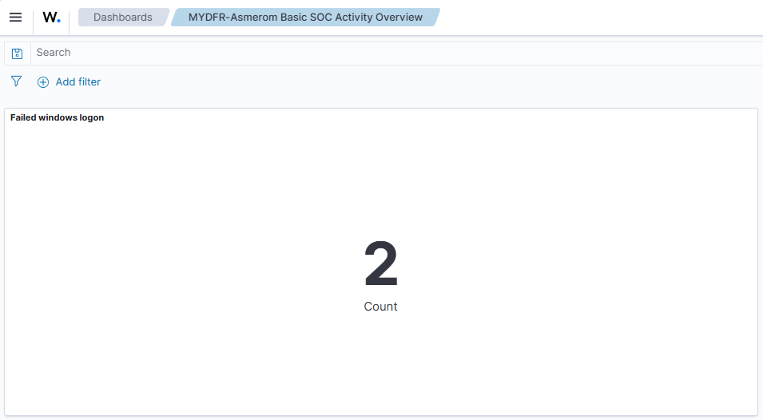
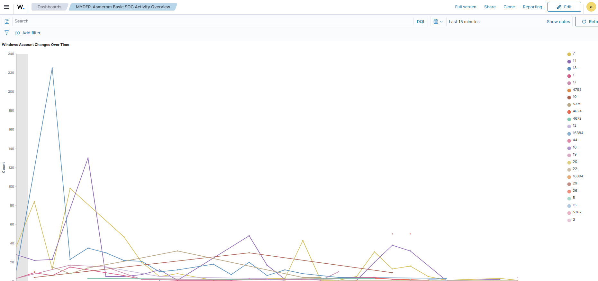
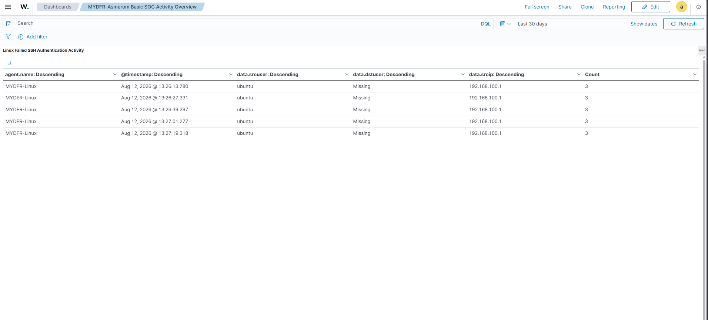
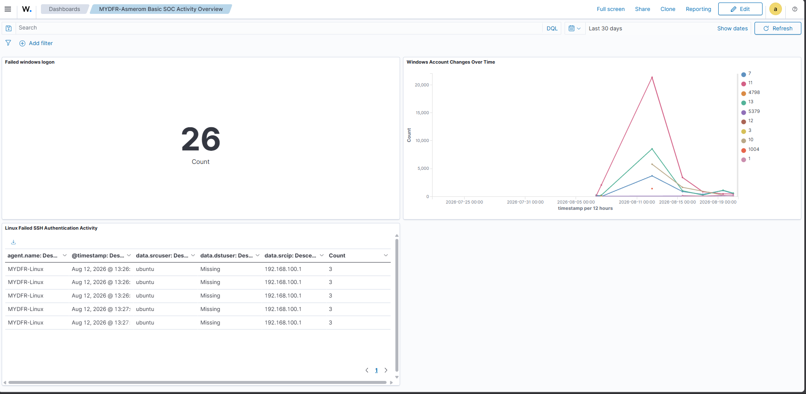

# Part 4: Dashboard bouwen

Doel: één dashboard met drie panelen bouwen op basis van de telemetrie uit Part 3. Dit dashboard is ook het eerste deliverable van de challenge.

### 1. Dashboard aanmaken

In het dashboard ben ik naar **Dashboards > Create new dashboard > Create new** gegaan. Voor de challenge moet de naam beginnen met `mydfir-<eigen naam>`, dus ik heb het dashboard opgeslagen als **`mydfir-Asmerom Basic SOC Activity Overview`**.

### 2. Paneel 1 — Metric: Failed Windows Logon

Ik heb een nieuw paneel gemaakt, type **Metric**, op de wazuh-archives index. Het event ID voor een mislukte Windows-login is **4625**. Rechtstreeks zoeken op "4625" is niet betrouwbaar, dus heb ik gefilterd op het exacte veld: `data.win.system.eventID:4625`. Om data te hebben, heb ik bewust drie keer een verkeerd wachtwoord ingevoerd op de Windows-VM. Ik heb het paneel opgeslagen als **"Failed Windows Logon"**.

### 3. Paneel 2 — Line chart: Windows Account Changes Over Time

Ik heb een nieuw paneel gemaakt, type **Line**, met een query op meerdere event ID's die met accountwijzigingen te maken hebben: `4720, 4722, 4723, 4724, 4725, 4726, 4732, 4733`. Onder Data heb ik de Y-as op **Count** gelaten en een bucket toegevoegd voor de X-as met aggregatie **Date Histogram** op het veld `timestamp`.

Om de resultaten per event ID te splitsen, bleek het veld `data.win.system.eventID` niet beschikbaar ("no cached mapping for this field"). Dit heb ik opgelost door naar **Dashboard Management > Index Patterns > wazuh-archives** te gaan en op **"Refresh field list"** te klikken — de beschikbare velden gingen van circa 600 naar bijna 900. Daarna kon ik de Split Series wél instellen op `data.win.system.eventID`. Zo krijg je een tijdlijn waarin je bijvoorbeeld een piek in 4733 ("A member was removed") direct ziet. Ik heb het paneel opgeslagen als **"Windows Account Changes Over Time"**.

### 4. Paneel 3 — Data table: Linux Failed SSH Authentication Activity

Ik heb een nieuw paneel gemaakt, type **Data table**, gefilterd op `agent.name: mydfir-Linux`. Zoekopdracht `"failed password"` gaf drie hits, precies de drie mislukte SSH-pogingen uit Part 3. Ik heb de volgende kolommen toegevoegd (elk als Split row > Terms):

- `agent.name` — welke machine
- `timestamp` — wanneer
- `data.source_user` — met welk account werd geprobeerd in te loggen
- `data.dst_user` — leverde geen resultaten op; opgelost met de optie **"Show missing values"**
- `data.source_ip` — het bron-IP-adres van de aanvaller

Ik heb het paneel opgeslagen als **"Linux Failed SSH Authentication Activity"**.

### 5. Resultaat

Het eindresultaat is één dashboard (`mydfir-Asmerom Basic SOC Activity Overview`) met drie panelen: een teller voor mislukte Windows-logins, een tijdlijn van Windows-accountwijzigingen, en een tabel met mislukte SSH-pogingen op Linux inclusief bron-IP. Dit dashboard is het eerste deliverable van de challenge — hiervan heb ik een volledige screenshot gemaakt met de `mydfir`-naam zichtbaar.

## Screenshots

