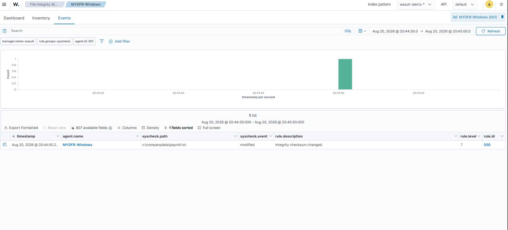
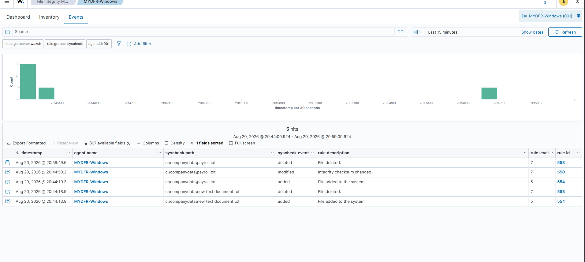
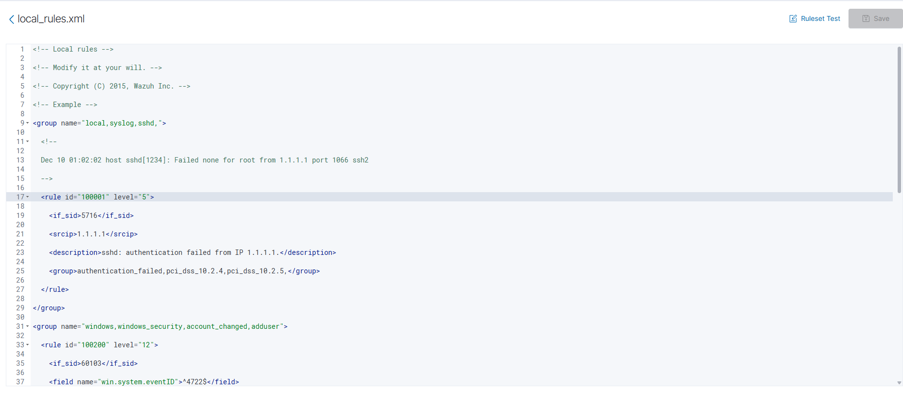
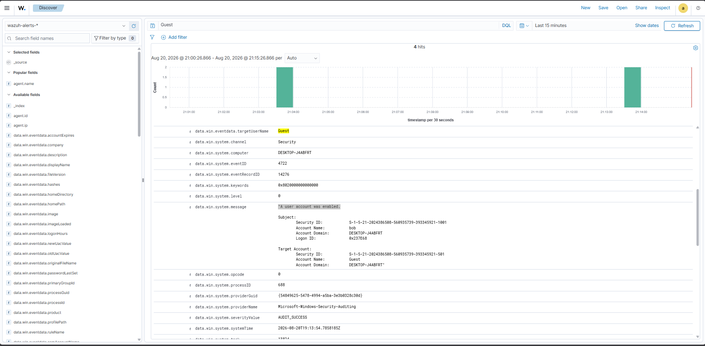

# Part 5: File Integrity Monitoring en een eigen detectieregel

Doel: Wazuh laten waarschuwen zodra een bestand wijzigt, wordt toegevoegd of verwijderd (FIM), en een eigen detectieregel bouwen die specifiek reageert op het inschakelen van het Guest-account.

### 1. File Integrity Monitoring op Windows

Op de Windows-VM heb ik een map `C:\company-data` aangemaakt met een testbestand `payroll.txt`. In `ossec.conf` (geopend met Kladblok als Administrator) staat standaard al een map met `directories realtime="yes"`. Ik heb die regel gekopieerd en het pad aangepast naar `C:\company-data`, opgeslagen, en de Wazuh-agent service herstart.

### 2. File Integrity Monitoring op Linux

Op de Ubuntu-VM heb ik met `sudo su -` als root gewerkt, een map `/opt/company-data` aangemaakt met een testbestand, en in `/var/ossec/etc/ossec.conf` de regel `<directories realtime="yes">/opt/company-data</directories>` toegevoegd. Ik heb opgeslagen en de Wazuh-agent service herstart.

### 3. FIM testen

Op Windows heb ik `payroll.txt` gewijzigd en daarna verwijderd — in het dashboard verschenen de events **"Integrity checksum changed"** en **"File deleted"**. Op Linux heb ik dezelfde test gedaan met hetzelfde resultaat.

### 4. Voorbereiding: Guest-account weer uitschakelen

Voordat ik de detectieregel kon testen, moest de uitgangssituatie kloppen: via **Computer Management > Local Users and Groups > Users** heb ik het Guest-account (dat in Part 3 was ingeschakeld) weer op "Account is disabled" gezet.

### 5. Custom detectieregel bouwen (eerste poging)

Eerst heb ik in Discover een werkende zoekquery opgebouwd: events waarbij `data.win.eventdata.targetUserName` gelijk is aan `guest`, gecombineerd met event ID **4722** ("account enabled"). In **Server Management > Rules > Custom rules > local_rules.xml** heb ik een AI-model gevraagd om op basis van deze query een Wazuh-regel te bouwen, met een verwijzing naar de officiële Wazuh-documentatie over de regel-syntax om de kans op fouten te verkleinen.

De voorgestelde regel heb ik toegevoegd met een group-naam, een uniek regel-ID, het veld `data.win.eventdata.targetUserName` en een beschrijving met mijn eigen naam erin ("mydfir-Asmerom"). Het level van de regel staat op 12 — Wazuh gebruikt niveaus van 0 (genegeerd) tot 16 (ernstige aanval), en 12 betekent een hoog belangrijk event. Ik heb de regel opgeslagen en herladen via **Reload**.

### 6. Regel testen — en troubleshooten waarom hij niet afging

Bij het opnieuw inschakelen van het Guest-account kreeg ik wél een alert, maar dat was de **standaard** ingebouwde Wazuh-regel, niet mijn eigen regel. Ik ben toen als volgt op zoek gegaan naar de oorzaak:

- Ik heb het rule-ID van mijn eigen regel opgezocht via `rule.id:<eigen-rule-id>` in Discover — geen resultaten.
- Ik heb de rule groups van het wél-triggerende event bekeken: `windows`, `windows_security`, `account_changed`.
- Ik heb een AI-model gevraagd waarom mijn regel niet afging. Antwoord: het veldpad klopte niet — het juiste veld is `win.system.eventID`, zonder `data.` ervoor.
- Ik heb de ingebouwde regel met ID 60110 opgezocht in de regel-XML: veldnaam `win.system.eventID`, groepen `account_changed`, `windows`, `windows_security`.
- Ik heb mijn eigen regel aangepast: het veldpad gecorrigeerd, de juiste groepen toegevoegd, en een `<if_sid>` toegevoegd die verwijst naar de ingebouwde regel 60109 — zo matcht mijn regel alleen wanneer dat basis-event ook al matcht.

Na opnieuw opslaan en herladen, en het Guest-account nog een keer uit- en ingeschakeld, verscheen in Discover mijn eigen regelbeschrijving: **"mydfir-Asmerom Windows guest account was enabled"**. De regel werkte.

**Wat ik hieruit heb geleerd:** AI is bruikbaar als startpunt én als hulpmiddel bij troubleshooten, maar de uitkomst moet je altijd zelf testen en controleren. Zonder te testen was deze fout (het verkeerde veldpad) niet aan het licht gekomen.

## Screenshots

