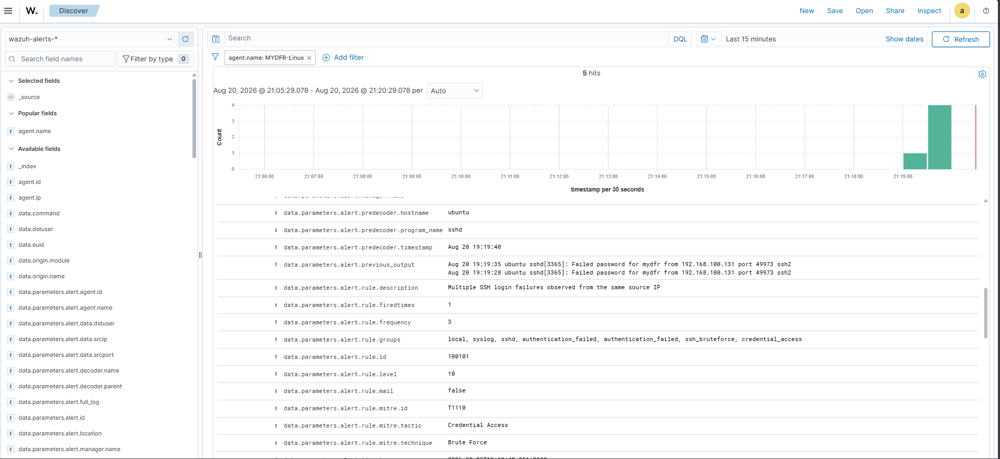
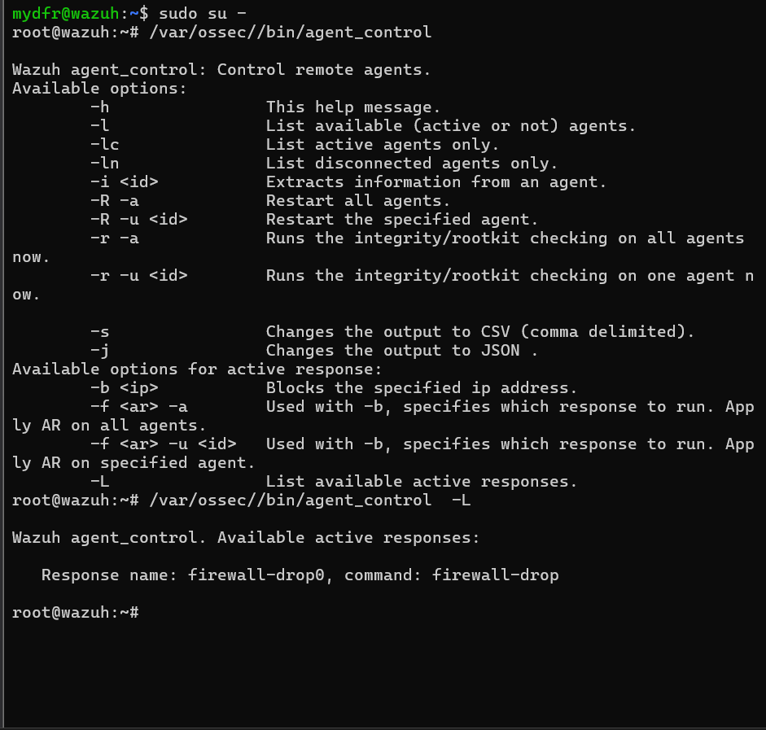
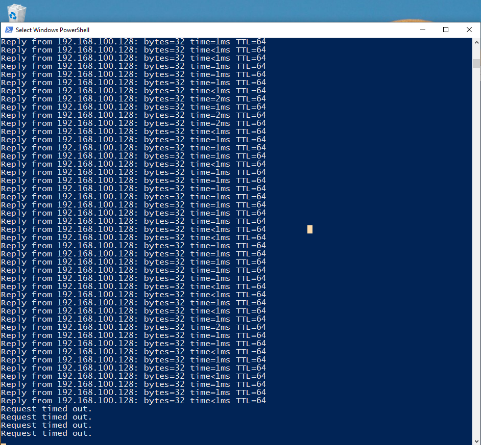
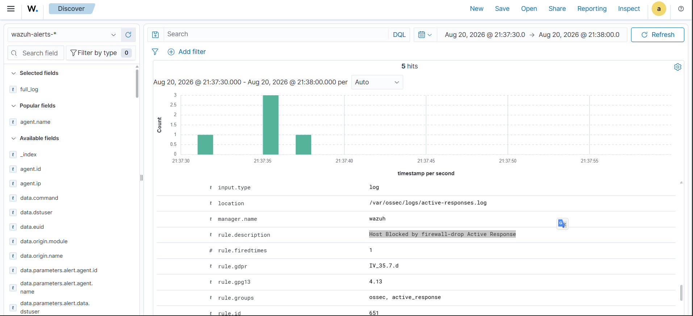
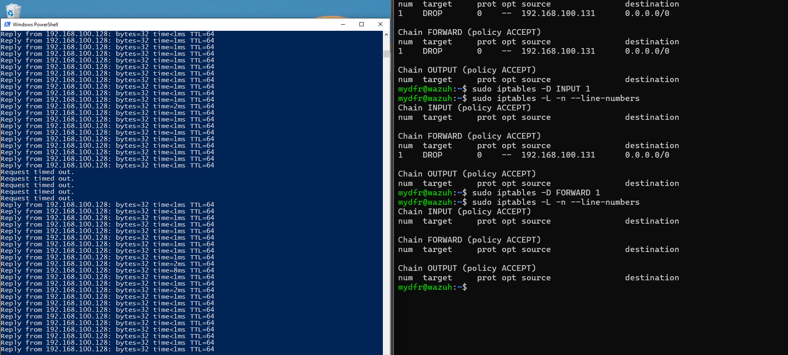

# Part 6: Automatisch reageren met Active Response

Doel: Wazuh niet alleen laten waarschuwen, maar ook automatisch laten ingrijpen — in dit geval het blokkeren van een bron-IP na herhaalde mislukte SSH-logins op mijn Ubuntu-server.

### 1. Bestaande regels bekijken

Vanaf de Windows-VM heb ik via PowerShell drie keer bewust een verkeerd wachtwoord ingevoerd bij het SSH'en naar mijn Ubuntu-VM. In het dashboard, onder **Discover**, gefilterd op de Linux-agent en de laatste 15 minuten, zag ik verschillende losse regels afgaan: "syslog user missed the password more than one time", "SSH connection reset", "authentication failed" en "PAM user login failed". Geen van deze regels herkende het patroon van meerdere pogingen als één geheel — dat wilde ik zelf bouwen.

### 2. Custom regel bouwen: brute force detectie

In **Server Management > Rules > Custom rules > local_rules.xml** heb ik een regel toegevoegd die ik met AI heb opgesteld, met de prompt: een regel maken die afgaat bij drie of meer mislukte SSH-logins. De regel is ingesteld op **120 seconden** (2 minuten) als tijdvenster, met als beschrijving "Multiple SSH login failures observed from the same source IP". Ik heb de regel opgeslagen en herladen via **Reload**.

### 3. Regel testen

In Discover, met de tijdspanne op de laatste 5 minuten, zag ik eerst geen resultaten. Daarna heb ik opnieuw drie keer een mislukte SSH-poging gedaan. Na een refresh verscheen de melding **"Multiple SSH login failures observed from the same source IP"** — de regel werkte.

### 4. Active response configureren

Op de Wazuh-server (via SSH) heb ik `sudo nano /var/ossec/etc/ossec.conf` geopend en gescrold naar het gedeelte **Active Response**, onder het gedeelte voor File Integrity Monitoring. Wazuh heeft standaard een aantal ingebouwde scripts beschikbaar, zoals `disable-account`, `restart-<service>`, `firewall-drop`, `host-deny` en `route-null`. Ik heb gekozen voor **`firewall-drop`**, dat een IP-adres toevoegt aan de firewall-deny-lijst (iptables).

Stappen:

1. Ik heb het bestaande voorbeeldblok voor `firewall-drop` gevonden — dit stond uitgecommentarieerd (met `<!--` en `-->`) en moest dus geactiveerd worden door die tekens te verwijderen.
2. Ik heb `<disabled>no</disabled>` ingesteld, zodat de active response actief staat.
3. Ik heb `<command>firewall-drop</command>` ingesteld — deze naam moet exact overeenkomen met de scriptnaam.
4. Ik heb `<location>local</location>` ingesteld — dit betekent dat het script draait op de agent die de melding veroorzaakte (in dit geval mijn Ubuntu-server).
5. Ik heb `<rules_id>100101</rules_id>` ingesteld — het rule-ID van mijn eigen brute-force-regel, terug te vinden in het dashboard bij het uitklappen van het triggerende event.
6. Ik heb opgeslagen (`Ctrl+X`, `Y`, `Enter`) en de Wazuh manager herstart: `sudo systemctl restart wazuh-manager`.

### 5. Configuratie controleren

Als root heb ik met het commando `/var/ossec/bin/agent_control -L` de beschikbare active responses opgevraagd. In de lijst stond `firewall-drop`, wat bevestigde dat mijn configuratie correct geladen was.

### 6. Bewijs: de blokkade testen

Om te bewijzen dat het werkte, heb ik vanaf de Windows-VM een oneindige ping gestart naar de Ubuntu-VM (`ping -t <ip>`) en gecontroleerd dat er verbinding was. Vervolgens heb ik in een tweede PowerShell-venster via SSH drie keer bewust een verkeerd wachtwoord ingevoerd. Direct daarna stopte de ping met **"Request timed out"** — er was geen verbinding meer. In het dashboard stond boven het triggerende event een nieuwe melding: **"Host blocked by firewall-drop active response"**. Het systeem had zelfstandig gereageerd op de aanval.

### 7. Connectiviteit herstellen

Om de blokkade weer op te heffen, ben ik via SSH ingelogd op de Ubuntu-VM (niet de Wazuh-server) en heb de huidige regels bekeken:

```
sudo iptables -L -n --line-numbers
```

Onder zowel de `INPUT`- als de `FORWARD`-keten stond het IP-adres van mijn Windows-VM als "DROP". Ik heb beide regels verwijderd:

```
sudo iptables -D INPUT 1
sudo iptables -D FORWARD 1
```

Na het opnieuw controleren met `iptables -L -n --line-numbers` waren de blokkades weg, en had mijn Windows-VM weer normale verbinding met de Ubuntu-server.

**Wat ik hieruit heb geleerd:** dit is een veilige, kleinschalige versie van active response — in een echte omgeving zou je zoiets zorgvuldiger inrichten (bijvoorbeeld met een menselijke goedkeuringsstap), maar het principe is hetzelfde: een detectieregel koppelen aan een automatische actie, en die actie ook weer kunnen terugdraaien.

## Screenshots






