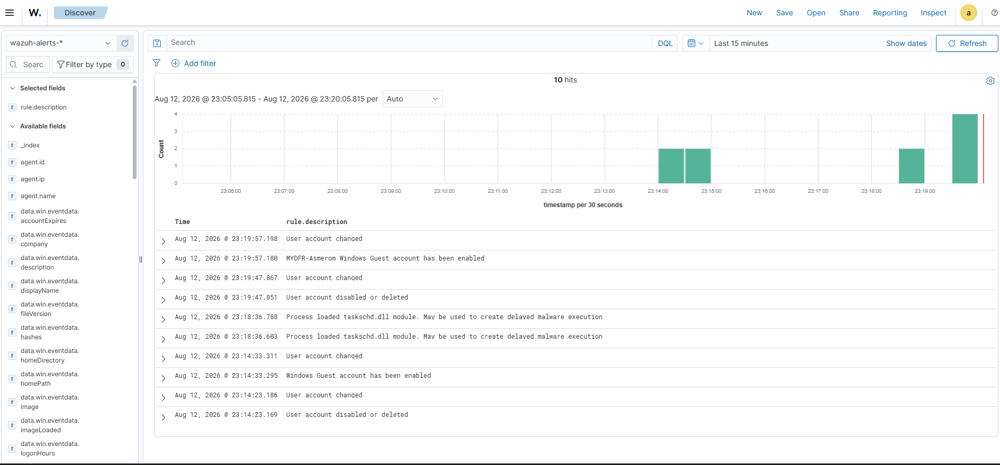
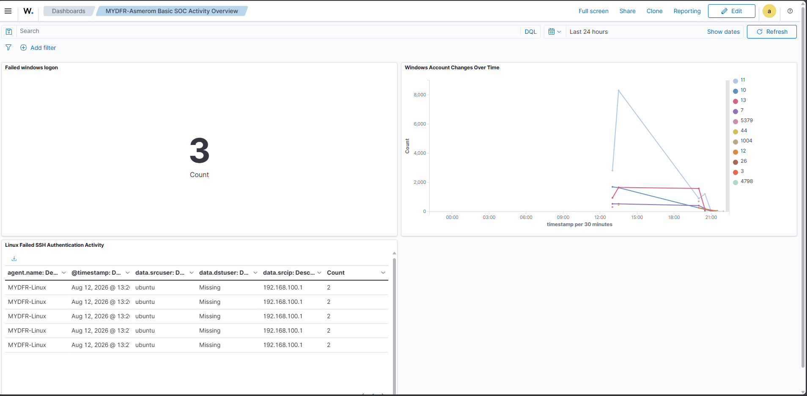

# Part 7: SOC-investigatierapport

Dit laatste deel is geen technische configuratie-stap, maar een opdracht: alle telemetrie en detecties uit Part 1 t/m 6 samenvoegen tot één volledig investigatierapport — het derde en laatste deliverable van de challenge.

## Context

In Part 3 en Part 6 heb ik zelf de rol van "aanvaller" gespeeld: het Guest-account ingeschakeld en van wachtwoord voorzien, een account aangemaakt en weer verwijderd, en het Ubuntu-systeem herhaaldelijk via SSH belaagd. In dit deel draai ik de rol om: ik ben nu de SOC-analist die moet reconstrueren wat er is gebeurd, puur op basis van de logs.

## Officiële richtvragen (MyDFIR Free Community)

- What happened?
- When did it happen?
- Which hosts were involved?
- Which accounts were changed?
- Was a file deleted?
- Was SSH abuse observed?
- What should we recommend?

## Rapport

### Findings (Wat heb ik gevonden)

- Het lokale Guest-account op de Windows-host is ingeschakeld en van een nieuw wachtwoord voorzien (event ID 4722 / account enabled).
- Een nieuw lokaal account `student1` is aangemaakt (event ID 4720), toegevoegd aan de lokale Administrators-groep (event ID 4732), en kort daarna weer verwijderd (event ID 4726).
- Op de Ubuntu-server zijn meerdere mislukte SSH-inlogpogingen waargenomen vanaf hetzelfde bron-IP binnen een tijdsbestek van enkele seconden — een patroon dat past bij een brute-force-poging.
- Mijn eigen Wazuh-detectieregel (rule ID 100101, "Multiple SSH login failures observed from the same source IP") is afgegaan.
- De Active Response `firewall-drop` heeft het bron-IP automatisch geblokkeerd (event: "Host blocked by firewall-drop active response").
- Geen bestand is kwaadwillig verwijderd in deze specifieke keten van events; wel is in Part 5 getest of File Integrity Monitoring bestandswijzigingen en -verwijderingen detecteert (dat werkte, los van dit scenario).

### Investigation Summary (Wat is er gebeurd)

Op de Windows-host is het Guest-account — dat standaard uitgeschakeld hoort te zijn — actief gemaakt en van een wachtwoord voorzien. Kort daarna is een nieuw account aangemaakt en direct aan de Administrators-groep toegevoegd, wat duidt op een poging tot privilege escalation, gevolgd door verwijdering van dat account (mogelijk om sporen te wissen). Vanaf dezelfde omgeving is vervolgens een reeks mislukte SSH-inlogpogingen uitgevoerd tegen de Ubuntu-server, wat een geautomatiseerde detectieregel deed afgaan. Wazuh heeft hierop zelfstandig gereageerd door het bron-IP te blokkeren via de firewall, waarmee verdere pogingen vanaf dat adres werden voorkomen.

### Who, What, When, Where, Why, How

**Who** — Het lokale account `Bob` op de Windows-VM heeft de accountwijzigingen uitgevoerd. De SSH-pogingen kwamen vanaf het IP-adres van diezelfde Windows-VM, gericht op het account `mydfir` op de Ubuntu-server.

**What** — Het Guest-account is ingeschakeld en van wachtwoord voorzien; een nieuw account (`student1`) is aangemaakt, aan de Administrators-groep toegevoegd en weer verwijderd; er zijn herhaalde mislukte SSH-inlogpogingen gedaan tegen de Ubuntu-server.

**When** — _[TODO: vul hier de exacte tijdstempels in uit je eigen Discover-events, inclusief tijdzone — bijvoorbeeld "23 juli 2026, 17:00–17:15 CEST". Dit moet uit jouw eigen logs komen, niet uit de video.]_ De activiteit vond plaats binnen één aaneengesloten sessie en is niet meer actief na de blokkade door Active Response.

**Where** — Binnen mijn eigen lab-omgeving: de Windows-VM (agent `mydfir-Windows`) als bron van de accountwijzigingen en de SSH-pogingen, en de Ubuntu-server (agent `mydfir-Linux`) als doelwit van de SSH-aanval.

**Why** — In dit geval is de activiteit bewust gegenereerd als onderdeel van de Wazuh SOC Analyst Challenge, om realistische telemetrie te produceren voor analyse. In een echte situatie zou dit patroon (guest-account activeren, snel een admin-account aanmaken en weer verwijderen, gevolgd door SSH brute-force) wijzen op een poging tot ongeautoriseerde toegang en persistentie.

**How** — De accountwijzigingen zijn uitgevoerd via lokale Windows-commando's (`net user`, `net localgroup`) in een Command Prompt met administratorrechten. De SSH-pogingen zijn uitgevoerd vanaf PowerShell op de Windows-VM, gericht op poort 22 van de Ubuntu-server.

### Recommendations

- Het Guest-account standaard uitgeschakeld houden en periodiek controleren of dit niet ongemerkt is gewijzigd (bijvoorbeeld met een Wazuh-alert zoals in Part 5).
- Wijzigingen aan de Administrators-groep altijd laten alerten, met extra aandacht voor accounts die kort na aanmaak weer verdwijnen — dat patroon is verdacht.
- SSH-toegang beperken tot sleutel-authenticatie in plaats van wachtwoorden, en waar mogelijk MFA toevoegen.
- Een lockout-mechanisme (zoals fail2ban) naast de Wazuh Active Response overwegen, zodat blokkades ook standaard op OS-niveau worden afgedwongen.
- De Active Response-configuratie (firewall-drop) periodiek testen, zodat je weet dat de automatische respons ook echt werkt wanneer het nodig is.

## Screenshots

